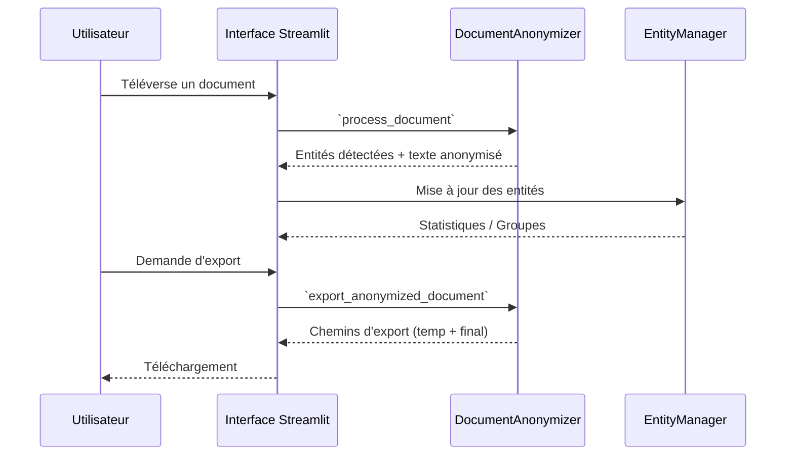
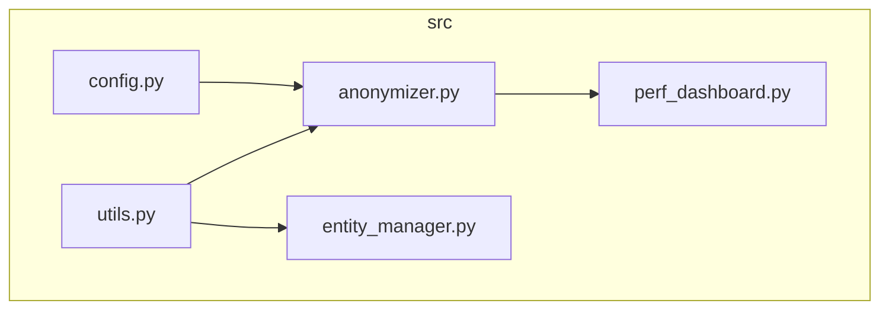

# Architecture du Projet

Ce document décrit l'architecture générale de l'anonymiseur ainsi que les
interactions principales entre les composants.

## Diagramme de séquence

## Schéma des modules (`src/`)

- **config.py** : Variables de configuration et constantes.
- **utils.py** : Fonctions utilitaires communes.
- **anonymizer.py** : Cœur de l'anonymisation (regex et IA).
- **entity_manager.py** : Gestion et regroupement des entités détectées.
- **perf_dashboard.py** : Visualisations et métriques de performance.
